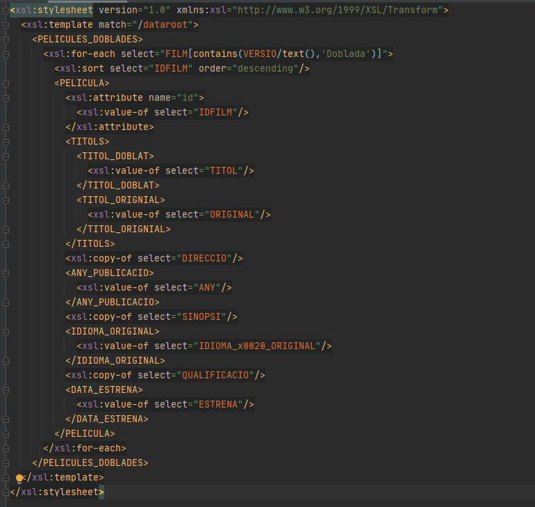
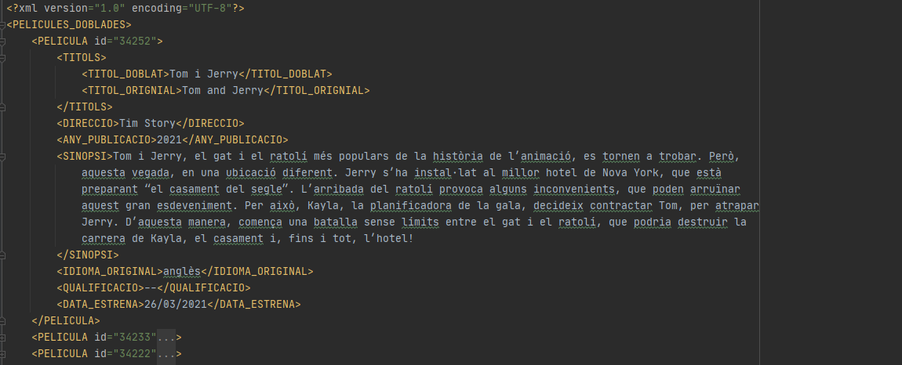
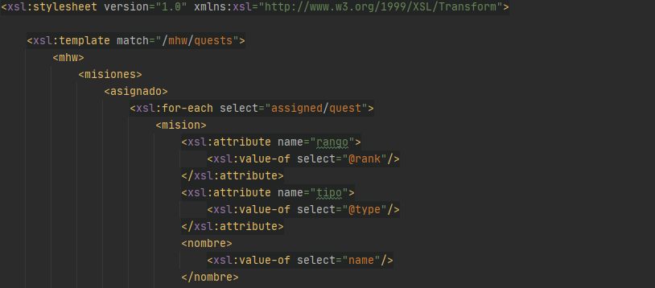
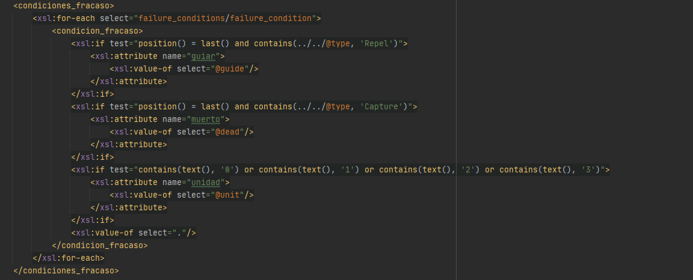
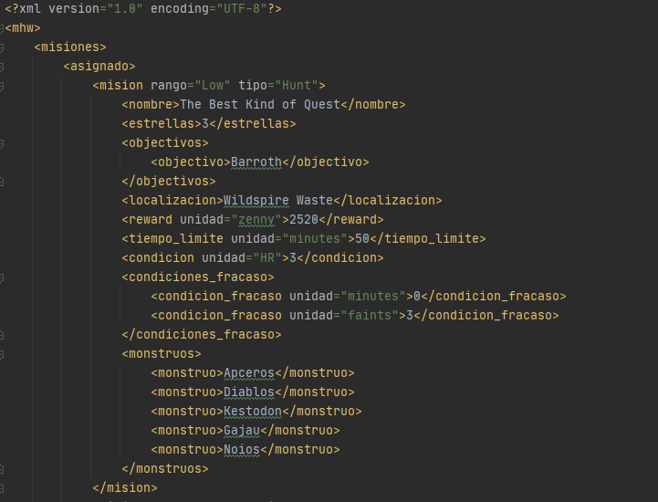
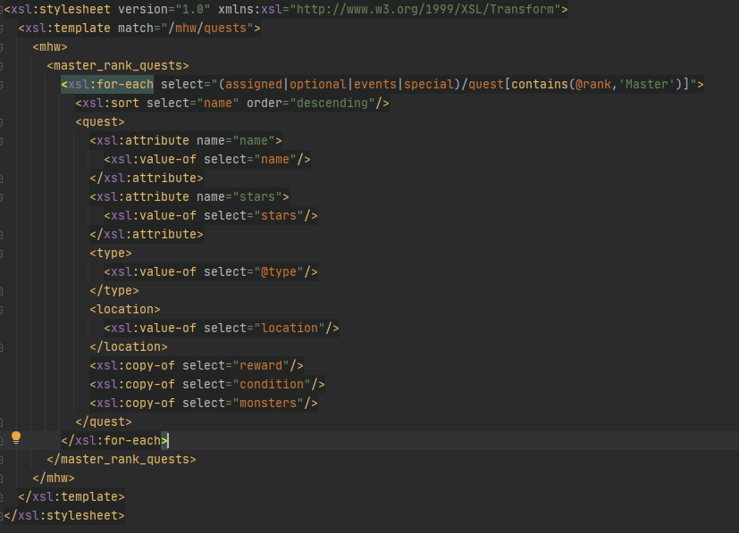
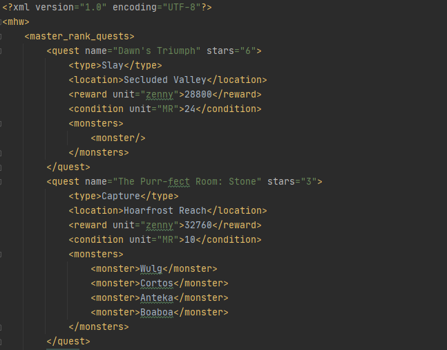

# AA2.2.3_XSLT_Dani

En aquest projecte utilitzo XSLT per donar estil a 2 XML.

## Apartats

1. Exercici 1
    1. XML Original Cinema en català([provacin.xml](src/Exercici1/provacin.xml))
    2. XSL de Cinema en català([provacin.xsl](src/Exercici1/provacin.xsl))
    3. XML reduit de Cinema en català([provacinresultat.xml](src/Exercici1/provacinresultat.xml))
    
2. Exercici 2
    * Versió 1
        1. XML Original MHW quests([mhwquests.xml](src/Exercici2/mhwquests.xml))
        2. XSL de MHW quests versió 1([mhwquestsversio1.xsl](src/Exercici2/mhwquestsversio1.xsl))
        3. XML traduit de MHW quests([mhwversio1.xml](src/Exercici2/mhwversio1.xml))
    * Versió 2 
        1. XML Original MHW quests([mhwquests.xml](src/Exercici2/mhwquests.xml))
        2. XSL de MHW quests versió 2([mhwquestsversio1.xsl](src/Exercici2/mhwquestsversio1.xsl))
        3. XML reduit de MHW quests de master rank([mhwversio2.xml](src/Exercici2/mhwversio2.xml))

## Exercici 1

Reduir l'XML originial a partir de XSLT a un fitxer XML nou.

### XSLT

 * Per començar el document he afegit al template part de la ruta per redundancia a les rutes.
 * Per reduir l'XML he decidit agafar només les pel·licules que van ser "Doblades" com es pot veure al for-each.
 * He ordenat cada una de les pel·licules per el seu ID.
 * Per finalitzar he afegit diverses etiquetes i atributs que he conseguiderat els més importants.

### XML

 * En aquest XML podem veure els resultats de aplicar l' XSL anterior
 

## Exercici 2
Prenen com a base un XML fet per mi mateix ([mhwquests.xml](src/Exercici2/mhwquests.xml)), es generaran 2 versions 
diferents. Una es traduira els etiquetes a espanyol (degut a que ya estaven originialment en angles) i l'altre es 
reduira per mostrar menys etiquetes.

### Versió 1
Traducció d'etiquetes i atributs a l'espanyol.

#### XSLT

* He creat la mateixa estructura però amb les etiquetes traduides i a partir d'un for-each a cada
tipus de quest he recreat XML original.

* La part més complicada ha sigut fer que les *failure_conditions* tinguessin un atribut diferent
depenent de si la *quest* era d'un determinat tipus.

#### XML

* XML resultant de aplicar l'anterior XSLT al XML original.

### Versió 2

Modificació del meu XML original per mostrar només les *quests* de master rank.

#### XSLT

* He decidit mostrar només les quests que tenen com a *rank*, *Master*.
* Els resultats estan ordenats per el nom de les *quests*.
* Les etiquetes *name* i *stars* les he afegit com atributs, i l' atribut *type* com a etiqeuta.
* He utilitzat *copy-of*  per les etiquetes que tenien subetiquetes o atributs i no tenia pensat
fer-los cap modificació

#### XML

* XML resultant de aplicar l'anterior XSLT al XML original.

## Author

Daniel López Romera | [Github](https://github.com/Daniel-LopezR)